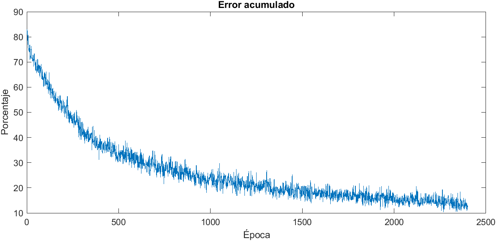

# M-Clasificador-Simple-Clima
Clasificador de imágenes sobre el clima escrito en MATLAB. El dataset y sus
imágenes fueron obtenidas de: Ajayi, Gbeminiyi (2018), “Multi-class Weather Dataset for 
Image Classification”, Mendeley Data, V1, doi: **10.17632/4drtyfjtfy.1**

## Contenido
El proyecto consta de **dos scripts principales** y algunos segundarios que están 
en la carpeta util. Los clasificadores están diseñados para usarlos en su
mayoría de forma **interactiva**. Se hicieron uno de **2 categorías** y uno de **4 
categorías** a clasificar, con el fin de ver cómo cambian de uno a otro, y que 
puedan ser **usados en otros datasets**.

En la carpeta util se encuentran 2 scripts, ambos tienen instrucciones:
- limpieza: usado para recortar las imágenes en un mínimo
- renombrar: usado para mover las imágenes y crear 3 datasets para pruebas

## Resultados
El clasificador de 2 clases logró categorizar de forma **aceptable** las etiquetas
"cloudy" y "sunrise" ya que son muy diferentes entre sí. Sin embargo, lo 
interesante que se descubrió fue cuando se intentó clasificar las 4 categorías
"sunrise", "cloudy", "rainy", "shine", es que no lo logró, ya que estas son 
muy parecidas entre sí.

Como se usó un modelo feed-forward, no se logró clasificar con gran precisión
las imágenes, incluso con un 10% de error sobre el dataset de training. Cuando 
se hizo sobre el dataset de verificación falló el 53%. Y en las pruebas, se 
equivoca también el 50%.

Por lo que se ha concluido que como el dataset es muy ambiguo en las etiquetas 
de muchas imágenes, no se podría clasificar tan sencillo con un modelo tradicional,
se considera que un modelo con convolución, sería muy ideal para este caso.
Sin embargo, estos scripts pueden ser usados en otros datasets, e incluso para
ver los resultados, se ha añadido un archivo .mat para que puedan cargar el 
espacio de trabajo con el comando:

    load cuatro_clases.mat
